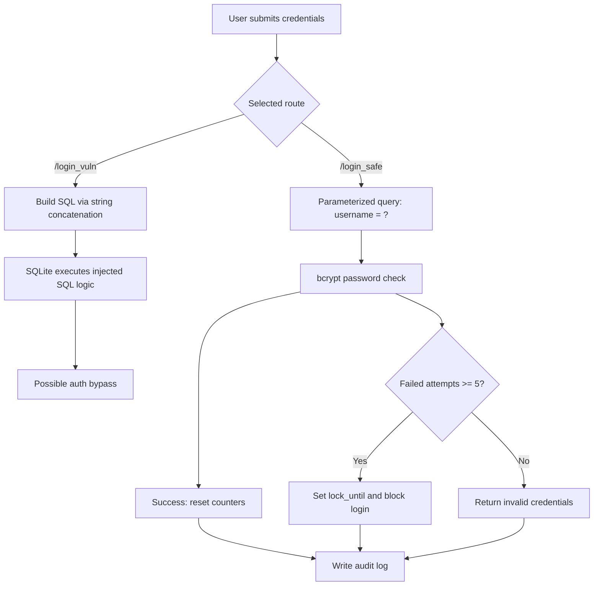

# SQL Injection-Based Authentication Bypass — Complete Project Reference

**Type:** Security Engineering Portfolio Project  
**Author:** Adimulam Yaswanth Veera Nagesh  
**Focus:** SQL injection detection, mitigation, and hardening controls  
**Repo:** https://github.com/yaswanth230755/sql-injection-auth-bypass-demo  
**Live Demo:** https://sql-injection-demo-jgb2.onrender.com

---

## Quick File Links

- Project overview: [README.md](README.md)
- Deployment notes: [DEPLOY_RESUME.md](DEPLOY_RESUME.md)
- Flask app entry: [sql_injection_demo/app.py](sql_injection_demo/app.py)
- Vulnerable module: [sql_injection_demo/auth_vulnerable.py](sql_injection_demo/auth_vulnerable.py)
- Secure module: [sql_injection_demo/auth_secure.py](sql_injection_demo/auth_secure.py)
- Database init: [sql_injection_demo/database.py](sql_injection_demo/database.py)
- Bootstrap init: [sql_injection_demo/bootstrap_db.py](sql_injection_demo/bootstrap_db.py)
- Logger utility: [sql_injection_demo/logger.py](sql_injection_demo/logger.py)
- Test suite: [tests/test_auth_flows.py](tests/test_auth_flows.py)

---

## Table of Contents

1. [Scope Lock](#1-scope-lock)
2. [Architecture and Data Flow](#2-architecture-and-data-flow)
3. [Literature Survey](#3-literature-survey)
4. [Revised Specification](#4-revised-specification)
5. [Technical Explanation](#5-technical-explanation)
6. [Implementation Progress](#6-implementation-progress)
7. [Test Matrix Results](#7-test-matrix-results)
8. [Demo Flow Script](#8-demo-flow-script)
9. [Rehearsal Checklist and Log](#9-rehearsal-checklist-and-log)
10. [Release-Readiness Checklist](#10-release-readiness-checklist)
11. [Deployment and Resume Notes](#11-deployment-and-resume-notes)
12. [Final Readiness Check](#12-final-readiness-check)
13. [Documentation Export Utilities](#13-documentation-export-utilities)
14. [Final Distribution Package](#14-final-distribution-package)
15. [7-Day Execution Plan](#15-7-day-execution-plan)
16. [Addendum: Extra Master Points](#16-addendum-extra-master-points)

---

## 1. Scope Lock

### Topic

SQL Injection-Based Authentication Bypass in a Self-Built Login Module with Parameterized Query Mitigation

### Objective Statement

Building a login system from scratch with two flows: an intentionally vulnerable module using string-concatenated SQL to demonstrate authentication bypass in a controlled lab, and a secure module using parameterized queries as the primary mitigation, supplemented by bcrypt password hashing, account lockout, and audit logging, with a comparative test matrix as evidence.

### Fixed Implementation Modules

| Module | Name | What It Proves |
|---|---|---|
| A | Vulnerable Login | Unsafe SQL construction allows authentication bypass |
| B | Secure Login | Parameterized query blocks the same bypass payload |
| C | Hardening | bcrypt + lockout + logging provide defense-in-depth |
| D | Validation | Test matrix + screenshots provide reproducible evidence |

### Scope Constraints

- Local machine only (plus optional cloud deployment for live demo)
- Test database and test users only (admin, alice, bob)
- No testing on public, live, or third-party systems
- Vulnerable module exists only for controlled security training and demonstration

### Project Completion Criteria

1. Vulnerable path shows bypass under crafted SQL payload
2. Secure path blocks the exact same payload
3. Normal valid login still works correctly on secure path
4. Results are documented with test matrix and screenshot evidence

### Inputs and Outputs

**Inputs:** Username (string, max 200 chars) · Password (string, max 200 chars) · Route: `/login_vuln` or `/login_safe`

**Outputs:** Login success/failure result page · Mode label (VULNERABLE or SECURE) · SQL query display · Attack/mitigation banners · Audit log entries (Module B+C only)

---

## 2. Architecture and Data Flow

### Project Structure

```
sql-injection-auth-bypass-demo/
├── sql_injection_demo/
│   ├── app.py               Flask routes — all request handling
│   ├── auth_vulnerable.py   Module A — unsafe SQL construction (demo only)
│   ├── auth_secure.py       Module B+C — parameterized query + hardening
│   ├── logger.py            Audit logging utility
│   ├── database.py          DB initialization and test user seeding
│   ├── bootstrap_db.py      Idempotent DB init (skips if DB already exists)
│   ├── __init__.py          Package marker
│   ├── requirements.txt     Pinned dependencies
│   ├── users.db             SQLite database (runtime, gitignored)
│   ├── auth.log             Flat-file audit log (runtime, gitignored)
│   └── templates/
│       ├── index.html       Home page — module selector
│       ├── login_vuln.html  Module A login form
│       ├── login_safe.html  Module B+C login form
│       ├── success.html     Login success result
│       ├── fail.html        Login failure result
│       └── learn.html       SQLi educational explanation page
├── tests/
│   ├── __init__.py
│   └── test_auth_flows.py   5 automated tests (all pass)
├── Procfile                 Heroku/Railway deployment
├── render.yaml              Render deployment config
├── LICENSE                  MIT
└── README.md
```

### Component Diagram

```
+─────────────────────────────────────────────────────────────+
│                        Browser                              │
+─────────────────────────────────────────────────────────────+
         |                              |
    POST /login_vuln              POST /login_safe
         |                              |
+─────────────────+         +───────────────────────+
│ auth_            │         │ auth_secure.py         │
│ vulnerable.py   │         │                        │
│ String concat   │         │ 1. Parameterized SQL   │
│ SQL (unsafe)    │         │ 2. bcrypt verify        │
+─────────────────+         │ 3. Lockout check       │
         |                  │ 4. Audit log           │
         |                  +───────────────────────+
         +──────────────────────────+
                        |
                 +──────────────+
                 │  users.db    │
                 │  users table │
                 │  audit_log   │
                 +──────────────+
                        |
                 +──────────────+
                 │  logger.py   │──────► auth.log
                 +──────────────+
```

### Mermaid Flowchart



### Route Behavior

| Route | Method | Handler | Behavior |
|---|---|---|---|
| `/` | GET | `index()` | Home page with module selector |
| `/learn` | GET | `learn()` | SQLi educational explanation |
| `/login_vuln` | GET/POST | `login_vuln()` | Module A — string-concatenated SQL |
| `/login_safe` | GET/POST | `login_safe()` | Module B+C — parameterized + hardening |

### Data Flow — Vulnerable Path (Module A)

```
1. User submits form → POST /login_vuln
2. app.py extracts username, password (truncated to 200 chars)
3. auth_vulnerable.py builds query by string concatenation:
   "SELECT * FROM users WHERE username = '" + username + "' AND password_plain = '" + password + "'"
4. sqlite3 cursor.execute() runs the raw constructed string
5. If any row returned → login accepted (even if via injection)
6. Result page shows the exact query executed
```

**Attack payload `' OR '1'='1' --`:**
```sql
SELECT * FROM users WHERE username = '' OR '1'='1' --' AND password_plain = 'anything'
-- '1'='1' is always TRUE → first row returned → bypass succeeds
```

### Data Flow — Secure Path (Module B+C)

```
1. User submits form → POST /login_safe
2. app.py extracts username, password (truncated to 200 chars)
3. auth_secure.py runs parameterized lookup:
   cursor.execute("SELECT * FROM users WHERE username = ?", (username,))
   → DB compiles template FIRST, binds value as data AFTER
4. If user not found → log event → return generic "Invalid credentials."
5. Check lock_until → if locked, return message with remaining time
6. bcrypt.checkpw(password, stored_hash) → verify without plaintext comparison
7. On failure: increment failed_attempts, lock if >= MAX_ATTEMPTS
8. On success: reset counters, log LOGIN_SUCCESS
9. logger.py writes event to auth.log and audit_log table
10. Result page shows parameterized template + mitigation explanation
```

### Database Schema

**users table:**

| Column | Type | Purpose |
|---|---|---|
| id | INTEGER PK | Auto-increment |
| username | TEXT UNIQUE | Login identifier |
| password_plain | TEXT | Vulnerable module only (naive dev mistake) |
| password_hash | TEXT | bcrypt hash — secure module only |
| role | TEXT | 'administrator' or 'user' |
| failed_attempts | INTEGER | Lockout failure counter |
| lock_until | REAL | Unix timestamp of lockout expiry (NULL = not locked) |

**audit_log table:**

| Column | Type | Purpose |
|---|---|---|
| id | INTEGER PK | Auto-increment |
| timestamp | TEXT | Event datetime |
| username | TEXT | Username involved |
| event | TEXT | Event label |
| source | TEXT | Source IP |

### Security Boundary Comparison

| Property | Module A (Vulnerable) | Module B+C (Secure) |
|---|---|---|
| SQL construction | String concatenation | Parameterized placeholder |
| Password column used | password_plain | password_hash (bcrypt) |
| Password comparison | SQL string equality | bcrypt.checkpw() |
| Brute-force protection | None | 5 attempts, 300s lockout |
| Audit trail | None | auth.log + audit_log table |
| Error messages | Raw SQL error may show | "Invalid credentials." only |
| Injection resistance | None — vulnerable by design | Full — input bound as data |
| User enumeration risk | Present | Prevented (same message always) |

---

## 3. Literature Survey

### 3.1 sqlmap

sqlmap automates SQLi detection and exploitation. Key functionalities: boolean-based, time-based, error-based, and union-based injection strategies across MySQL, PostgreSQL, SQLite, Oracle, and MSSQL. Useful for assessment automation, but this project manually implements the vulnerable pattern to show the root cause at code level rather than relying on automated tools.

### 3.2 Burp Suite

Burp Suite supports HTTP interception, replay, fuzzing, and scanner-assisted vulnerability discovery. It is relevant for identifying candidate injection points in web workflows and for observing how payloads affect HTTP requests/responses.

### 3.3 OWASP Testing and Prevention Guidance

OWASP Top 10 2021 — A03:2021 Injection and the SQL Injection Prevention Cheat Sheet recommend parameterized queries as the primary SQLi control. The testing guide documents common payload families: tautology (`' OR '1'='1' --`), union-based, comment-truncation (`admin' --`), and inference/time-based.

### 3.4 Parameterized Queries / Prepared Statements

Parameterized execution separates SQL code from user data. For Python sqlite3, placeholder `?` is used. The DB engine receives the template first, compiles the execution plan, then binds the user value as a typed literal. Input cannot be parsed as SQL tokens, preventing structural query manipulation.

### 3.5 bcrypt Password Hashing

bcrypt adds per-password salt and configurable computational cost. Published by Provos and Mazières (1999), it is suited for password verification workflows and resists rainbow-table attacks better than plaintext or fast hash functions (MD5, SHA-1). Salt ensures identical passwords produce different hashes on each call.

### 3.6 Technique Comparison

| Technique | Layer | SQLi Prevention Strength | Notes |
|---|---|---|---|
| Parameterized queries | DB execution | High — structural | Primary and required baseline |
| Input validation / filtering | App layer | Medium/low | Useful but bypassable via encoding |
| Stored procedures | DB layer | Medium/high | Safe only when parameterized internally |
| WAF | Edge/network | Partial | Signature-based; can be evaded |
| ORM | App/data access | Medium/high | Raw query methods bypass protections |

**Key takeaway:** Parameterized queries are the only consistently reliable baseline control across all payload variations because they work at the DB execution layer, not the application layer.

---

## 4. Revised Specification

### 4.1 Functional Requirements

| ID | Requirement |
|---|---|
| FR1 | Home page provides navigation to vulnerable login, secure login, and learning page |
| FR2 | Vulnerable route builds SQL query by direct string concatenation of username and password |
| FR3 | Vulnerable route displays the constructed SQL query in the result page |
| FR4 | Secure route uses parameterized placeholder binding exclusively |
| FR5 | Secure route verifies passwords using bcrypt hash comparison |
| FR6 | Secure route increments failed_attempts on each wrong password |
| FR7 | Secure route locks account for 300 seconds after 5 consecutive failures |
| FR8 | Secure route logs every authentication event to auth.log and audit_log table |
| FR9 | Secure route returns generic "Invalid credentials." — never exposes raw SQL errors |
| FR10 | Database is resettable to clean state by running bootstrap_db or database.py |
| FR11 | /learn route renders educational explanation of SQL injection |

### 4.2 Non-Functional Requirements

| ID | Requirement |
|---|---|
| NFR1 | Vulnerable and secure logic in separate Python files |
| NFR2 | All result pages show active module mode |
| NFR3 | Application handles empty, long (500+ char), and unicode inputs without crashing |
| NFR4 | Demonstration reproducible from clean DB state |
| NFR5 | Deployable to cloud via Render/Railway using Procfile and render.yaml |

### 4.3 Acceptance Criteria

1. Crafted SQL injection payloads bypass the vulnerable login flow
2. The same payloads are blocked in the secure login flow
3. Valid credentials authenticate correctly in the secure flow
4. Account lockout triggers after 5 failed attempts and holds correctly
5. All automated tests pass (`python -m unittest discover -s tests -v`)
6. Application deploys and runs on Render with live URL accessible

---

## 5. Technical Explanation

### 5.1 Why the Vulnerable Version Is Exploitable

```python
# THE DANGEROUS LINE — user input becomes part of SQL code
query = (
    "SELECT * FROM users "
    "WHERE username = '" + username + "' "
    "AND password_plain = '" + password + "'"
)
cursor.execute(query)
```

When username is `' OR '1'='1' --`:

```sql
SELECT * FROM users WHERE username = '' OR '1'='1' --' AND password_plain = 'anything'
```

| Fragment | Effect |
|---|---|
| `username = ''` | Closes the username string early |
| `OR '1'='1'` | Attacker-injected always-true condition |
| `--` | SQL comment — everything after ignored |
| `AND password_plain = 'anything'` | Password check — commented out |

Result: WHERE clause reduces to TRUE. First row returned. Authentication bypassed with no valid password.

### 5.2 Why Parameterized Queries Prevent Bypass

```python
# THE FIX — parameterized placeholder binding
c.execute("SELECT * FROM users WHERE username = ?", (username,))
```

| Step | What happens |
|---|---|
| 1 | App sends template: `SELECT * FROM users WHERE username = ?` |
| 2 | DB parser compiles and locks query structure. Parsing complete. |
| 3 | User value `' OR '1'='1' --` sent to DB driver |
| 4 | Driver binds value as typed string literal into `?` slot |
| 5 | Parser never sees the value — cannot alter grammar |
| 6 | DB searches for user whose username literally equals `' OR '1'='1' --` |
| 7 | No such user. Returns nothing. Login fails correctly. |

### 5.3 Why Input Validation Alone Is Insufficient

- **Encoding attacks:** `%27` decodes to `'` after validation runs
- **Unicode normalization:** Unicode lookalikes for SQL characters bypass naive filters
- **Second-order injection:** Input stored cleanly, used in an unprotected query later
- **Developer error:** Custom filters have gaps and edge cases

Parameterized queries operate at the DB driver layer — structurally impossible to bypass through input content.

### 5.4 bcrypt — Why It Matters

bcrypt generates a random salt per hash. Same password → different hash every call. Defeating rainbow tables. bcrypt is intentionally slow — brute-forcing each hash requires significant computation even if the DB is leaked.

### 5.5 Deployment Note on WAF Behavior

On the live Render deployment, some managed-edge WAF signatures block `OR 1=1` patterns. The functionally equivalent payload `' OR TRUE --` demonstrates the same vulnerability and is used for live demo reproducibility. Locally, both forms work identically. This does not change the core result: parameterized queries block all tautology forms at the DB execution layer.

### 5.6 Short Viva Answer (30–45 seconds)

> "The vulnerable login concatenates user input directly into SQL, letting injected operators make the WHERE clause always true — bypassing authentication with no valid password. The secure login uses a parameterized query: the DB compiles structure first, then binds input as typed data. Input cannot alter grammar — the parser is already done. bcrypt protects stored passwords, lockout defeats brute force, and audit logging provides traceability. The fix is structural code/data separation at the DB execution layer."

### 5.7 Viva Q&A

| Question | Answer |
|---|---|
| What does `?` do? | DB compiles template first; value bound as data after — parser never sees input |
| Why not just sanitize? | Encoding/unicode tricks bypass filters; parameterization is structural |
| Why bcrypt? | Random salt per hash; slow by design; rainbow tables defeated |
| Why lockout? | Throttles online brute-force against hashed passwords |
| Why logging? | Traceability for incident detection and forensic evidence |
| What is user enumeration? | Inferring valid usernames from different error messages; prevented by generic response |
| What proves mitigation? | Same 3 payloads bypass vulnerable, blocked by secure; valid login still works |
| Why keep vulnerable code? | Controlled security-training demo only; isolated file; never used in production |

---

## 6. Implementation Progress

### 6.1 Completed Steps

| Step | Task | Status |
|---|---|---|
| 1 | Scope lock finalized | ✓ |
| 2 | Dependencies installed (flask, bcrypt, gunicorn) | ✓ |
| 3 | Full project structure created | ✓ |
| 4 | database.py + bootstrap_db.py | ✓ |
| 5 | auth_vulnerable.py — Module A | ✓ |
| 6 | auth_secure.py — Module B+C | ✓ |
| 7 | logger.py — audit logging | ✓ |
| 8 | app.py — Flask routes (including /learn) | ✓ |
| 9 | All 6 HTML templates | ✓ |
| 10 | tests/test_auth_flows.py — 5 tests, all pass | ✓ |
| 11 | Application verified at localhost:5000 | ✓ |
| 12 | Deployed to Render with live URL | ✓ |
| 13 | 17-row test matrix executed — 17/17 passed | ✓ |
| 14 | Evidence screenshots captured (11 files) | ✓ |
| 15 | Rehearsals completed twice — both PASS | ✓ |

### 6.2 Automated Tests

```bash
python -m unittest discover -s tests -v
# 5 tests, all PASS
```

Test coverage:
1. Home route loads (HTTP 200)
2. Vulnerable route shows bypass behavior for SQLi payload
3. Secure route blocks same SQLi payload
4. Account lockout triggers after 5 repeated failures
5. Audit log file written on authentication event

### 6.3 Run Commands (Verified)

```bash
# Local
git clone https://github.com/yaswanth230755/sql-injection-auth-bypass-demo.git
cd sql-injection-auth-bypass-demo
python -m venv .venv && source .venv/bin/activate
pip install -r sql_injection_demo/requirements.txt
python -m sql_injection_demo.bootstrap_db
python sql_injection_demo/app.py
# Open http://localhost:5000

# Production-like (Gunicorn)
python -m sql_injection_demo.bootstrap_db
gunicorn -b 0.0.0.0:8000 sql_injection_demo.app:app
```

---

## 7. Test Matrix Results

**Date executed:** 2026-04-06 | **Result: 17/17 PASSED**

| ID | Username Input | Password | Module | Expected | Actual | Pass/Fail | Key Point | Evidence |
|---|---|---|---|---|---|---|---|---|
| T01 | admin | adminpass123 | Vulnerable | Success | Success | **PASS** | Normal flow works | ev01 |
| T02 | admin | adminpass123 | Secure | Success | Success | **PASS** | Normal flow works | ev02 |
| T03 | alice | wrongpass | Vulnerable | Fail | Fail | **PASS** | Wrong password rejected | — |
| T04 | alice | wrongpass | Secure | Fail | Fail | **PASS** | Wrong password rejected + logged | — |
| T05 | nobody | anything | Vulnerable | Fail | Fail | **PASS** | Unknown user rejected | — |
| T06 | nobody | anything | Secure | Fail | Fail | **PASS** | Unknown user rejected + logged | — |
| T07 | `' OR '1'='1' --` | anything | **Vulnerable** | **BYPASS** | **BYPASS** | **PASS** | Core tautology attack | ev03 |
| T08 | `' OR '1'='1' --` | anything | **Secure** | **BLOCKED** | **BLOCKED** | **PASS** | Core mitigation | ev04 |
| T09 | `admin' --` | anything | **Vulnerable** | **BYPASS** | **BYPASS** | **PASS** | Comment truncation | ev05 |
| T10 | `admin' --` | anything | **Secure** | **BLOCKED** | **BLOCKED** | **PASS** | Comment truncation blocked | ev06 |
| T11 | `' OR TRUE --` | anything | **Vulnerable** | **BYPASS** | **BYPASS** | **PASS** | Alternate tautology | — |
| T12 | `' OR TRUE --` | anything | **Secure** | **BLOCKED** | **BLOCKED** | **PASS** | Alternate tautology blocked | — |
| T13 | alice | wrongpass ×5 | Secure | Locked | Locked | **PASS** | Lockout triggers | ev07 |
| T14 | alice | alice2024 | Secure (locked) | Still locked | Still locked | **PASS** | Lockout holds | — |
| T15 | (empty) | (empty) | Both | Fail gracefully | Fail | **PASS** | Empty input handled | — |
| T16 | 500-char string | anything | Both | Fail, no crash | Fail | **PASS** | Long input robust | — |
| T17 | ünïcödé | anything | Both | Fail gracefully | Fail | **PASS** | Unicode handled | — |

### Before / After Summary

| Input | Vulnerable | Secure |
|---|---|---|
| Valid credentials | Success | Success |
| Wrong password | Fail | Fail |
| `' OR '1'='1' --` | **BYPASS** | **BLOCKED** |
| `admin' --` | **BYPASS** | **BLOCKED** |
| `' OR TRUE --` | **BYPASS** | **BLOCKED** |
| 5× wrong password | No protection | Locked 300s |
| Empty input | Fail gracefully | Fail gracefully |
| 500-char input | Fail, no crash | Fail, no crash |

### Evidence File Map

| File | Content |
|---|---|
| ev01_normal_vuln.png | Normal login success — vulnerable side |
| ev02_normal_secure.png | Normal login success — secure side |
| ev03_attack_bypass.png | T07 bypass with query displayed |
| ev04_attack_blocked.png | T08 blocked with mitigation banner |
| ev05_comment_attack.png | T09 admin' -- bypass |
| ev06_comment_blocked.png | T10 admin' -- blocked |
| ev07_lockout.png | T13 lockout triggered |
| ev08_audit_log.png | auth.log contents |
| ev09_code_vuln.png | Dangerous concatenation line |
| ev10_code_secure.png | Parameterized query line |
| ev11_bcrypt_hash.png | $2b$ hash in DB column |

---

## 8. Demo Flow Script

### Pre-Demo Setup

```bash
cd sql-injection-auth-bypass-demo
python -m sql_injection_demo.bootstrap_db   # reset to clean state
python sql_injection_demo/app.py            # start on port 5000
# Second terminal:
tail -f sql_injection_demo/auth.log         # watch events live
```

Have ready: browser at `http://localhost:5000` · terminal with live log · code editor open at the dangerous line and fix line · test matrix file.

### Minute 1 — Problem Statement

> "SQL injection is OWASP A03:2021. Authentication bypass is the most impactful form — an attacker logs in without any valid credentials by injecting SQL syntax through a normal input field. I built this system from scratch with two flows: one vulnerable, one secure."

### Minutes 2–3 — Module A: Vulnerable Demo

1. Click Vulnerable Login
2. Normal login first: `admin / adminpass123` → shows success
3. Attack payload: username `' OR '1'='1' --`, password `hello` → submit
4. Point to red banner: "ATTACK SUCCESSFUL — AUTHENTICATION BYPASSED"
5. Point to query on page: explain `OR '1'='1'` = always true, `--` comments out password check
6. Second payload `admin' --` to reinforce

### Minutes 4–5 — Module B+C: Secure Demo

1. Return home → Secure Login
2. Same payload `' OR '1'='1' --` → blocked
3. Point to green mitigation banner
4. Open `auth_secure.py` → point to: `c.execute("SELECT * FROM users WHERE username = ?", (username,))`
5. "DB compiles template first. Value bound as data after. Parser never sees input."
6. Valid login `alice / alice2024` → still works

### Minute 6 — Hardening

```bash
# Show bcrypt hash in terminal:
python3 -c "import sqlite3; c=sqlite3.connect('sql_injection_demo/users.db').cursor(); c.execute('SELECT username, password_hash FROM users'); print(c.fetchall())"
```

- Point to `$2b$` prefix — "stored as bcrypt hash, never plaintext"
- Fail login 5 times → show lockout message with remaining seconds
- Show `auth.log` — "every event logged, no passwords"

### Minute 7 — Results

- Show test matrix: T07–T12 show before/after contrast, 17/17 passed
- "Parameterized queries enforce SQL code/data separation at the DB execution layer. This is structural — it cannot be bypassed through input content manipulation."

---

## 9. Rehearsal Checklist and Log

### Rehearsal Checklist

**Before demo:**
- [ ] `python -m sql_injection_demo.bootstrap_db` runs cleanly
- [ ] App starts on port 5000
- [ ] `http://localhost:5000` loads home page
- [ ] Vulnerable login — normal creds work
- [ ] Vulnerable login — `' OR '1'='1' --` bypasses
- [ ] Secure login — same payload blocked
- [ ] Secure login — 5 failures trigger lockout
- [ ] `tail -f auth.log` shows events, no passwords

**During demo (checklist):**
- [ ] Problem statement under 45 seconds
- [ ] Normal flow shown before attack
- [ ] Query explained token by token
- [ ] Code line pointed to (dangerous line + fix line)
- [ ] bcrypt hash shown in terminal
- [ ] Lockout triggered live
- [ ] Test matrix shown

### Rehearsal Log

```
Rehearsal 1 — 2026-04-06T02:36:57
Home page reachable:              PASS
Normal login (vulnerable side):   PASS
Attack bypass visible:            PASS
Secure side blocks same payload:  PASS
Valid login on secure side:       PASS
bcrypt hash shown in terminal:    PASS
Lockout behavior visible:         PASS
auth.log entries shown:           PASS
Test matrix shown:                PASS
Overall status:                   PASS
Time taken:                       ~6 minutes

Rehearsal 2 — 2026-04-06T02:37:24
All checks:                       PASS
Overall status:                   PASS
Time taken:                       ~5.5 minutes
```

---

## 10. Release-Readiness Checklist

### Core Documentation and Quality Gates

| Item | Status |
|---|---|
| Literature survey — history, OWASP, types, breaches, tools | ✓ Done |
| Revised specification — modules, I/O, FR, schema | ✓ Done |
| Architecture diagram and step-by-step data flows | ✓ Done |
| DB schema documented (both tables) | ✓ Done |
| `python -m sql_injection_demo.bootstrap_db` runs | ✓ Done |
| App starts and home page loads | ✓ Done |
| Professional documentation structure is complete | ✓ Done |
| Long-form document has export-friendly layout | ✓ Done |
| References in IEEE format | ✓ Done |
| Export naming convention defined for shared artifacts | ✓ Done |

### Demo and Engineering Validation Gates

| Item | Status |
|---|---|
| Vulnerable and secure in separate files with clear labels | ✓ Done |
| Dangerous concatenation line visible and annotated | ✓ Done |
| Parameterized `?` line visible and annotated | ✓ Done |
| T07/T08 — same payload: bypass vuln, blocked secure | ✓ Done |
| T09/T10 — same payload: bypass vuln, blocked secure | ✓ Done |
| T11/T12 — same payload: bypass vuln, blocked secure | ✓ Done |
| bcrypt `$2b$` prefix visible in DB | ✓ Done |
| Lockout triggers after 5 failures | ✓ Done |
| auth.log populates, no passwords in log | ✓ Done |
| 5 automated tests — all pass | ✓ Done |
| 17-row test matrix complete | ✓ Done |
| All 11 evidence screenshots present | ✓ Done |
| Demo rehearsed twice | ✓ Done |
| Can explain `?` binding without notes | ✓ Ready |
| Can point to dangerous line and fix line during demo | ✓ Ready |

### Common Mistakes — Guards

| Mistake | Guard |
|---|---|
| Only theory, no working code | App runs and is deployed live |
| Input validation claimed as full mitigation | Report and code explicitly state it is secondary |
| Plaintext passwords in DB | Secure module uses bcrypt only; password_plain only used by vulnerable module |
| No before/after evidence | T07/T08, T09/T10, T11/T12 pairs in test matrix |
| No ethical scope statement | Section 4 of report |
| Cannot explain own code | Rehearsed twice; can point to exact lines |

---

## 11. Deployment and Resume Notes

### Live Demo

https://sql-injection-demo-jgb2.onrender.com

### Deployment (Render)

1. Push repo to GitHub
2. New Blueprint in Render → connect repo
3. Render reads `render.yaml` for build/start commands
4. Deployment complete → generated URL accessible

```yaml
buildCommand: pip install -r sql_injection_demo/requirements.txt
startCommand: python -m sql_injection_demo.bootstrap_db && gunicorn -b 0.0.0.0:$PORT sql_injection_demo.app:app
```

### Alternative (Railway / Heroku-style)

Uses `Procfile`:
```
web: python -m sql_injection_demo.bootstrap_db && gunicorn -b 0.0.0.0:${PORT:-8000} sql_injection_demo.app:app
```

### Resume-Ready Highlights

- Built and deployed a Flask security demo showing SQL injection authentication bypass versus parameterized-query mitigation
- Implemented defense-in-depth: bcrypt password hashing, account lockout, and dual-channel audit logging
- Designed side-by-side vulnerable/secure login flows with on-screen query display for clear exploitability and remediation contrast
- Added `/learn` educational route explaining SQLi mechanics and prevention
- Deployed to Render with Gunicorn, idempotent DB bootstrap, and automated tests
- 5 automated tests covering bypass behavior, lockout, and audit logging — all pass

### Deployment Note on WAF

On managed deployment, edge WAF may block obvious signatures like `OR 1=1`. The equivalent payload `' OR TRUE --` demonstrates the same vulnerability and is used for live demo reproducibility. Locally both forms work identically.

---

## 12. Final Readiness Check

### Night-Before-Demo Verification

```bash
cd sql-injection-auth-bypass-demo
python -m sql_injection_demo.bootstrap_db
python sql_injection_demo/app.py
```

Browser checks (all must pass):
1. `http://localhost:5000` loads — both module cards and learn card visible
2. Vulnerable login → `admin / adminpass123` → success
3. Vulnerable login → `' OR '1'='1' --` / anything → BYPASS shown
4. Secure login → same payload → BLOCKED shown
5. Secure login → fail 5 times → lockout message appears
6. `cat sql_injection_demo/auth.log` → events visible, no passwords

Automated test check:
```bash
python -m unittest discover -s tests -v
# Expected: 5 tests, all PASS
```

Port conflict resolution:
```bash
PORT=5001 python sql_injection_demo/app.py
```

---

## 13. Documentation Export Utilities

### Suggested Export Filename

Use:

`Yaswanth_SQLi_Project_Master.pdf`

### Markdown to PDF Options

Option 1 (Pandoc):

```bash
pandoc FINAL_COMPLETE_SUBMISSION_MASTER.md -o AdimulamYaswanthVeeraNagesh_B230755CS.pdf \
    --pdf-engine=wkhtmltopdf \
    --margin-top=25mm --margin-bottom=25mm \
    --margin-left=25mm --margin-right=25mm
```

Option 2 (VS Code):
1. Install Markdown PDF extension.
2. Open this file.
3. Export to PDF.

Option 3 (Browser print):
1. Open rendered markdown preview.
2. Print to PDF.

### Export Checklist

1. Keep exported document readable with consistent margins.
2. Ensure references are in IEEE style.
3. Verify project metadata and links before sharing.

---

## 14. Final Distribution Package

Recommended final folder structure:

```text
submission_package/
├── report/
│   ├── AdimulamYaswanthVeeraNagesh_B230755CS.pdf
│   └── FINAL_COMPLETE_SUBMISSION_MASTER.md
├── source_code/
│   ├── app.py
│   ├── auth_vulnerable.py
│   ├── auth_secure.py
│   ├── database.py
│   ├── bootstrap_db.py
│   ├── logger.py
│   ├── __init__.py
│   ├── requirements.txt
│   └── templates/
│       ├── index.html
│       ├── learn.html
│       ├── login_vuln.html
│       ├── login_safe.html
│       ├── success.html
│       └── fail.html
├── tests/
│   ├── __init__.py
│   └── test_auth_flows.py
└── evidence/
        ├── ev01_normal_vuln.png
        ├── ev02_normal_secure.png
        ├── ev03_attack_bypass.png
        ├── ev04_attack_blocked.png
        ├── ev05_comment_attack.png
        ├── ev06_comment_blocked.png
        ├── ev07_lockout.png
        ├── ev08_audit_log.png
        ├── ev09_code_vuln.png
        ├── ev10_code_secure.png
        └── ev11_bcrypt_hash.png
```

---

## 15. 7-Day Execution Plan

| Day | Planned Work | Completion Signal |
|---|---|---|
| Day 1 | Environment setup + DB init + literature notes | DB initializes and app starts |
| Day 2 | Vulnerable module and normal-flow tests | Normal vulnerable login works |
| Day 3 | Secure module and SQLi block verification | Same payload bypass/block comparison works |
| Day 4 | Add lockout, bcrypt, logging | Lockout + log events visible |
| Day 5 | Execute full test matrix and capture evidence | 17/17 matrix complete |
| Day 6 | Final report polishing and references | PDF draft ready |
| Day 7 | End-to-end rehearsal and final checks | Demo completes under 7 minutes |

---

## 16. Addendum: Extra Master Points

1. Parameterized query is the non-negotiable primary SQLi control.
2. Input filtering is secondary only; never a replacement.
3. Keep vulnerable and secure logic isolated in separate modules.
4. Show same payload on both routes for before/after proof.
5. Keep logs free of sensitive data (never log raw passwords).
6. Keep local and cloud behavior notes explicit (for WAF signature differences).
