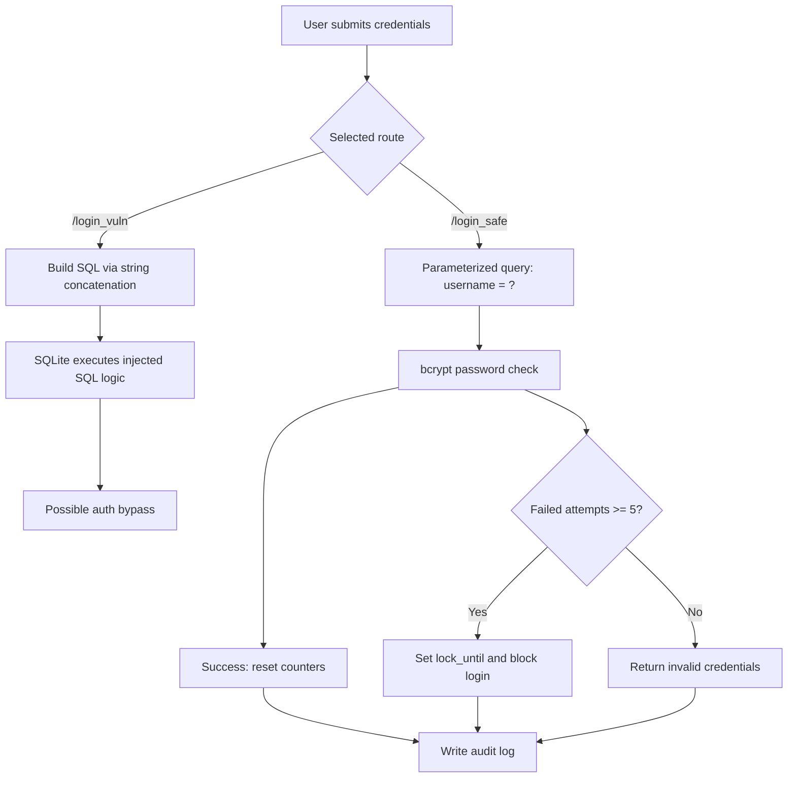

# sql-injection-auth-bypass-demo

Security-focused Flask demo that contrasts an intentionally vulnerable login flow against a secure, parameterized-query flow.

Known limitation (demo scope): the vulnerable login route is intentionally insecure for teaching purposes and is not production-safe.

## Live Demo

- https://sql-injection-demo-jgb2.onrender.com

## Quick Navigation

- Final master document: [PROJECT_MASTER_GUIDE.md](PROJECT_MASTER_GUIDE.md)
- Deployment notes: [DEPLOYMENT_GUIDE.md](DEPLOYMENT_GUIDE.md)
- Main app entrypoint: [sql_injection_demo/app.py](sql_injection_demo/app.py)
- Vulnerable auth module: [sql_injection_demo/auth_vulnerable.py](sql_injection_demo/auth_vulnerable.py)
- Secure auth module: [sql_injection_demo/auth_secure.py](sql_injection_demo/auth_secure.py)
- Automated tests: [tests/test_auth_flows.py](tests/test_auth_flows.py)

## Highlights

- Module A (vulnerable): SQL string concatenation to demonstrate authentication bypass
- Module B (secure): parameterized query binding to block SQL injection
- Module C (hardening): bcrypt password hashing, account lockout, and audit logging
- Includes side-by-side UI routes for manual testing

## Architecture (Vulnerable vs Secure Flow)



## Tech Stack

- Python
- Flask
- SQLite
- bcrypt
- Gunicorn

## Quick Start (Local)

```bash
# Skip clone if you already have the repository
git clone https://github.com/yaswanth230755/sql-injection-auth-bypass-demo.git
cd sql-injection-auth-bypass-demo
python -m venv .venv
source .venv/bin/activate
pip install -r sql_injection_demo/requirements.txt
python -m sql_injection_demo.bootstrap_db
python sql_injection_demo/app.py
```

Run commands from the repository root (`sql-injection-auth-bypass-demo`) so relative paths resolve correctly.

Open:

- http://127.0.0.1:5000/
- Vulnerable route: `/login_vuln`
- Secure route: `/login_safe`

## Automated Tests

```bash
python -m unittest discover -s tests -v
```

## Test Payloads (Demo)

Use these on the vulnerable route to observe bypass behavior:

- Username: `' OR '1'='1' --` | Password: `anything`
- Username: `admin' --` | Password: `anything`
- Username: `' OR TRUE --` | Password: `anything`

Try the same payloads on `/login_safe` to see mitigation in action.

## Deploy

For deployment options and platform-specific setup, see [DEPLOYMENT_GUIDE.md](DEPLOYMENT_GUIDE.md).

## Security Notice

This project contains an intentionally vulnerable route for educational demonstration only. Do not use this code pattern in production systems.
