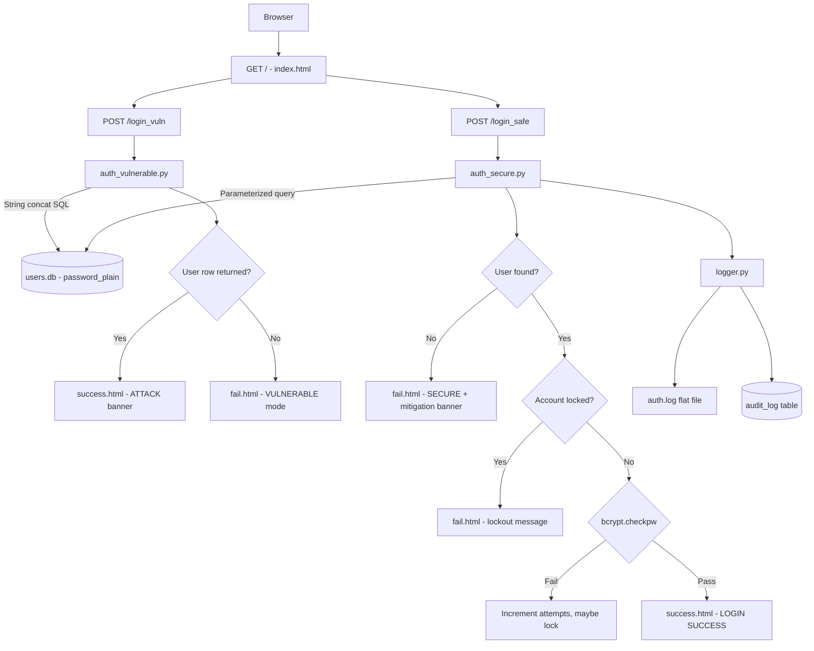

# Evaluation 1 &mdash; Architecture and Data Flow

**Course:** CS4033E Computer Security | NIT Calicut  
**Topic:** SQL Injection-Based Authentication Bypass in a Self-Built Login Module with Parameterized Query Mitigation

---

## 1. Project Structure

```
sql_injection_demo/
├── app.py               Flask routes — orchestrates all request handling
├── auth_vulnerable.py   Module A — unsafe SQL construction (demo only)
├── auth_secure.py       Module B+C — parameterized query + hardening
├── logger.py            Audit logging utility
├── database.py          DB initialization and test user seeding
├── __init__.py          Package marker for import compatibility
├── users.db             SQLite database (auto-created by database.py)
├── auth.log             Flat-file audit log (auto-created on first event)
└── templates/
    ├── index.html       Home page — module selector
    ├── login_vuln.html  Module A login form
    ├── login_safe.html  Module B+C login form
    ├── success.html     Login success result
    └── fail.html        Login failure result
```

---

## 2. Component Architecture Diagram

```
+──────────────────────────────────────────────────────────────+
│                          Browser                             │
+──────────────────────────────────────────────────────────────+
           |                              |
    GET/POST /login_vuln          GET/POST /login_safe
           |                              |
+──────────────────+         +───────────────────────+
│ auth_vulnerable  │         │ auth_secure.py         │
│ .py              │         │                        │
│                  │         │ 1. Parameterized SQL   │
│ String concat    │         │ 2. bcrypt verify       │
│ SQL (unsafe)     │         │ 3. Lockout check       │
│                  │         │ 4. Audit log           │
+──────────────────+         +───────────────────────+
           |                              |
           +──────────────+───────────────+
                          |
                  +───────────────+
                  │   users.db    │
                  │               │
                  │  users table  │
                  │  audit_log    │
                  +───────────────+
                          |
                  +───────────────+
                  │   logger.py   │──────► auth.log
                  +───────────────+
```

---

## 3. Mermaid Flowchart



---

## 4. Route-Level Behavior

| Route | Method | Behavior |
|---|---|---|
| `/` | GET | Renders home page with links to both modules |
| `/login_vuln` | GET | Renders vulnerable login form |
| `/login_vuln` | POST | Calls `vulnerable_login()`, renders result with query shown |
| `/login_safe` | GET | Renders secure login form |
| `/login_safe` | POST | Calls `secure_login()`, renders result with template shown |

---

## 5. Data Flow &mdash; Vulnerable Path (Module A)

```
Step 1: User submits username + password to POST /login_vuln
Step 2: app.py extracts form values, truncates to 200 chars
Step 3: auth_vulnerable.py builds query by concatenation:
            "SELECT * FROM users WHERE username = '" + username +
            "' AND password_plain = '" + password + "'"
Step 4: sqlite3 cursor.execute() runs the raw constructed string
Step 5: If any row is returned → login accepted (even via injection)
Step 6: Result page shows the exact query that was executed
```

**Attack scenario with payload `' OR '1'='1' --`:**

```sql
Input query becomes:
SELECT * FROM users WHERE username = '' OR '1'='1' --' AND password_plain = 'anything'

OR '1'='1' is always TRUE → first row returned → bypass succeeds
```

---

## 6. Data Flow &mdash; Secure Path (Module B+C)

```
Step 1: User submits username + password to POST /login_safe
Step 2: app.py extracts form values, truncates to 200 chars
Step 3: auth_secure.py performs parameterized lookup:
            cursor.execute("SELECT * FROM users WHERE username = ?", (username,))
            → DB compiles template first, binds value as data after
Step 4: If user not found → log event → return "Invalid credentials."
Step 5: Check lock_until → if locked, return message with remaining time
Step 6: bcrypt.checkpw(password, stored_hash) → verify without plaintext comparison
Step 7: On failure: increment failed_attempts, lock if >= MAX_ATTEMPTS
Step 8: On success: reset counters, log LOGIN_SUCCESS
Step 9: logger.py writes event to auth.log (flat) and audit_log (table)
Step 10: Result page shows parameterized template + mitigation explanation
```

**Same attack payload `' OR '1'='1' --` on secure path:**

```
DB searches for user whose username literally equals ' OR '1'='1' --
No such user exists → returns nothing → login fails correctly
```

---

## 7. Security Boundary Comparison

| Property | Module A (Vulnerable) | Module B+C (Secure) |
|---|---|---|
| SQL construction | String concatenation | Parameterized placeholder |
| Password column used | password_plain (plaintext) | password_hash (bcrypt) |
| Password comparison method | SQL string equality | bcrypt.checkpw() |
| Brute-force protection | None | Lockout: 5 attempts, 300s |
| Audit trail | None | auth.log + audit_log table |
| Error messages shown | Raw SQL error may appear | Generic "Invalid credentials." only |
| Injection resistance | None — vulnerable by design | Full — input bound as data |
| User enumeration risk | Present | Prevented (same message for all failures) |
